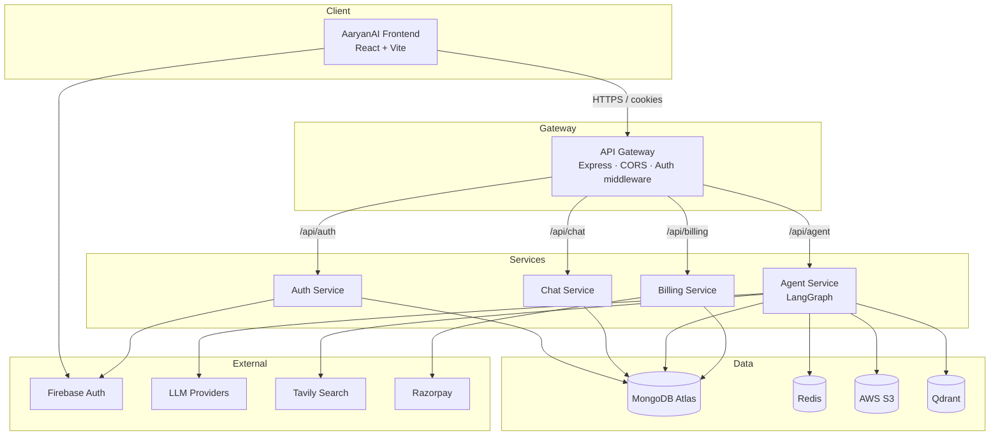
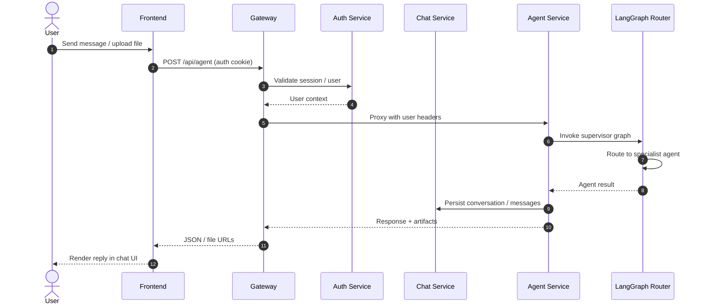
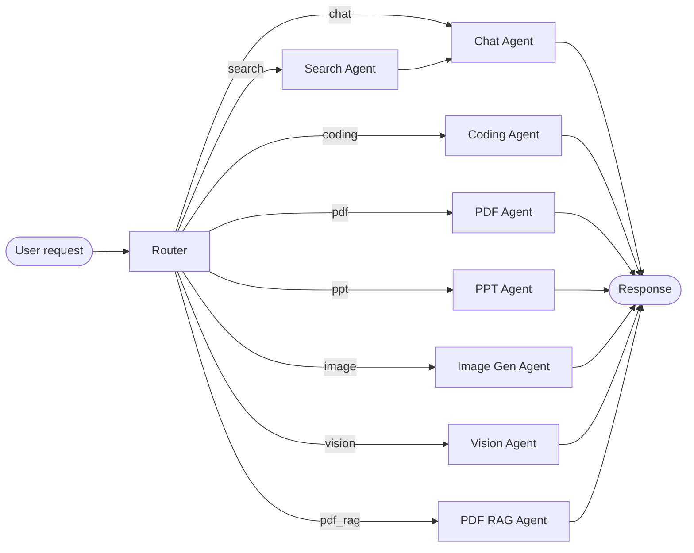
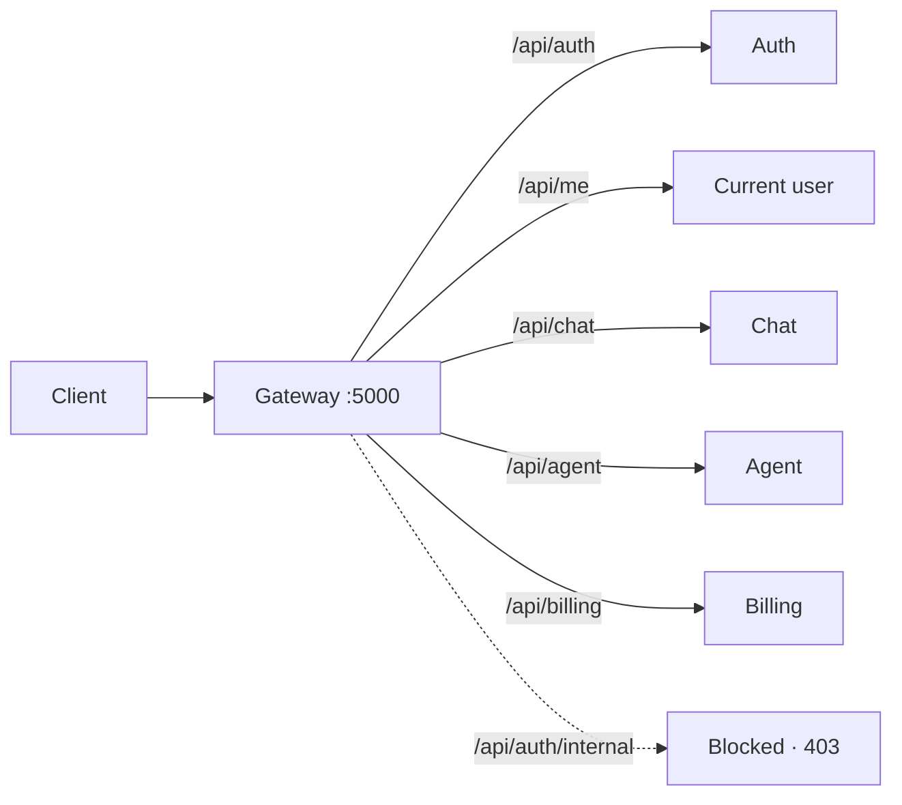

# AaryanAI

**Think clearer. Build faster.**

AaryanAI is a multi-agent AI platform for chat, coding, search, PDF/PPT generation, vision, image generation, and billing — with a React frontend and a microservices backend behind an API gateway.

**Repo:** [aaryansrawat18/AaryanAI-MultiAgent](https://github.com/aaryansrawat18/AaryanAI-MultiAgent)

---

## Features

| Capability | Description |
| --- | --- |
| Chat | General conversation and explanations |
| Coding | Code generation, debugging, architecture help |
| Search | Live web lookup (Tavily) for current events |
| PDF / PPT | Document and slide generation |
| Vision / Image | Image understanding and generation |
| PDF RAG | Ask questions over uploaded PDFs |
| Billing | Plans, credits, and Razorpay payments |
| Auth | Firebase-backed authentication |

---

## Project structure

```
AaryanAI-MultiAgent/
├── frontend/                 # React + Vite + Redux client
└── backend/
    ├── gateway/              # API gateway (auth + proxy)
    ├── shared/redis/         # Shared Redis helper
    ├── docker-compose.yml    # Local Redis
    └── services/
        ├── auth/             # Users + Firebase
        ├── chat/             # Conversations + messages
        ├── agent/            # LangGraph supervisor + agents
        └── billing/          # Credits + Razorpay
```

---

## High-level architecture



---

## Request flow

End-to-end path when a signed-in user sends a message:



---

## Multi-agent (LangGraph) flow

The agent service uses a **supervisor graph**: every request starts at the **router**, then moves to one specialist agent.



### Routing rules (simplified)

| Input signal | Routed agent |
| --- | --- |
| Image file | `vision` |
| PDF file | `pdf_rag` |
| Explicit agent selected | That agent |
| Otherwise | LLM router chooses: `chat`, `search`, `coding`, `pdf`, `ppt`, or `image` |

`search` results are handed to `chat` for a final natural-language answer.

---

## Gateway API map



Protected routes (`/api/me`, `/api/chat`, `/api/agent`, `/api/billing`) require auth middleware. Internal auth routes are never exposed through the gateway.

---

## Tech stack

**Frontend:** React 19, Vite, Redux Toolkit, Tailwind CSS, Firebase, Framer Motion, Monaco Editor  

**Backend:** Node.js, Express, MongoDB, Redis, LangGraph / LangChain, Multer, AWS S3, Qdrant, Razorpay, Docker  

---

## Getting started

### Prerequisites

- Node.js 18+
- Redis (or `docker compose` in `backend/`)
- MongoDB connection string
- Firebase project
- API keys for the LLM providers you enable
- (Optional) AWS S3, Qdrant, Tavily, Razorpay, Cloudinary

### 1. Clone

```bash
git clone https://github.com/aaryansrawat18/AaryanAI-MultiAgent.git
cd AaryanAI-MultiAgent
```

### 2. Frontend

```bash
cd frontend
cp .env.example .env   # if present; otherwise create .env
npm install
npm run dev
```

Runs at `http://localhost:5173` (or the next free Vite port).

### 3. Backend services

Start Redis:

```bash
cd backend
docker compose up -d
```

Create a `.env` in each service (`gateway`, `auth`, `chat`, `agent`, `billing`) with the required secrets, then in each service folder:

```bash
npm install
npm run dev   # or npm start
```

Typical local ports (confirm in each `.env`):

| Service | Role |
| --- | --- |
| Gateway | Public API entry |
| Auth | Firebase + users |
| Chat | Conversations |
| Agent | Multi-agent graph |
| Billing | Plans + payments |

Point the frontend API base URL at the gateway.

### 4. Environment notes

- Never commit `.env` or Firebase `serviceAccount.json` (already gitignored).
- Keep `INTERNAL_SERVICE_SECRET` identical across services that call each other.
- Gateway `AUTH_SERVICE`, `CHAT_SERVICE`, `AGENT_SERVICE`, `BILLING_SERVICE` must point at the running service URLs.

---

## Security

- Secrets and service accounts stay local / in a secret manager — not in git.
- Gateway blocks `/api/auth/internal`.
- User-facing agent/chat/billing routes go through auth middleware.

---

## License

ISC — see package manifests for details.
